# UnityMeshDecimation

[中文版說明](./README_tc.md)

Mesh Decimation for [Unity](https://unity.com/).

This project is based on [vcglib tridecimator](https://github.com/cnr-isti-vclab/vcglib/tree/master/apps/tridecimator) but rewritten for Unity Mesh and add other features.

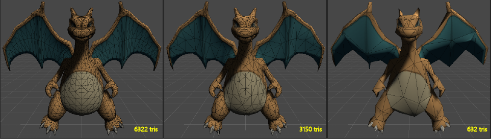
Charizard © Pokémon Ltd

## Compatibility

Only tested with below versions but may be compatible with other versions.

| Version
|------
| Unity 2018.4.x
| Unity 2020.3.x

## Usage

Use whole project or copy `Assets/UnityMeshDecimation` to your project

### GUI

Open tool from menu `Window/Unity Mesh Decimation`

+ Input Mesh

    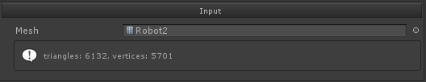

+ End Condition

    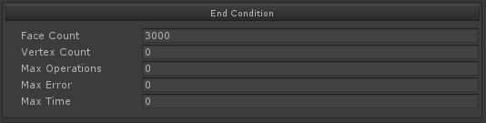

+ Edge Collapse Parameters

    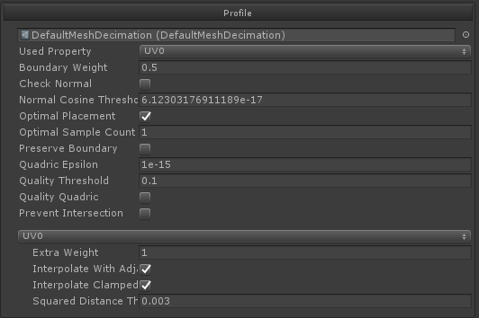

+ Output File

    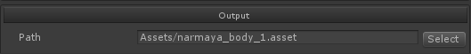

### Script

```csharp
using UnityMeshDecimation;

// End Condition
var conditions= new TargetConditions();
conditions.faceCount = 1000;

// Edge Collapse Parameters
var parameter = new EdgeCollapseParameter();
parameter.UsedProperty = VertexProperty.UV0;

var meshDecimation = new UnityMeshDecimation();
meshDecimation.Execute(inputMesh, parameter, conditions);

var outputMesh = meshDecimation.ToMesh();
```

## Extra Weight

Besides adding vertex properties to Quadrics, you can also add extra weight to prevent moving on the bondery of property.

For example, one vertex has different uv coordinates on connected faces.

```csharp
var parameter = new EdgeCollapseParameter();
parameter.UsedProperty = VertexProperty.UV0;

var property = parameter.GetPropertySetting(VertexProperty.UV0);
property.ExtraWeight = 1;

// Default sample function is self, but you can define a custom one.
// For example, use sampled color instead of uv coordinate.
// property.SampleFunc = (Vector4 value) => {
//    return value;
// };
```

<table>
    <tr>
        <td>Position</td>
        <td>Position, UV</td>
        <td>Position, UV, UV extra weight</td>
    </tr>
    <tr>
        <td>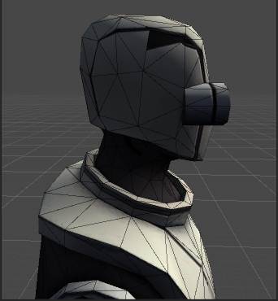</td>
        <td>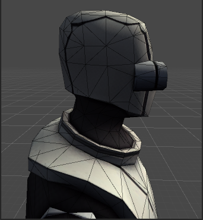</td>
        <td>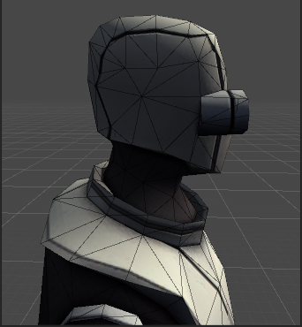</td>
    </tr>
</table>

## Example

+ Lucy © Stanford University

<table>
    <tr>
        <td>99970 tris<br>(Source)</td>
        <td></td>
        <td>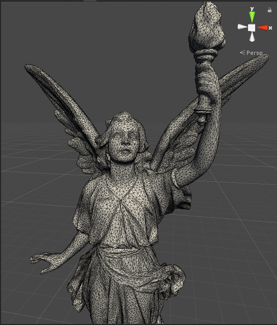</td>
    </tr>
    <tr>
        <td>50000 tris<br>(50%)</td>
        <td>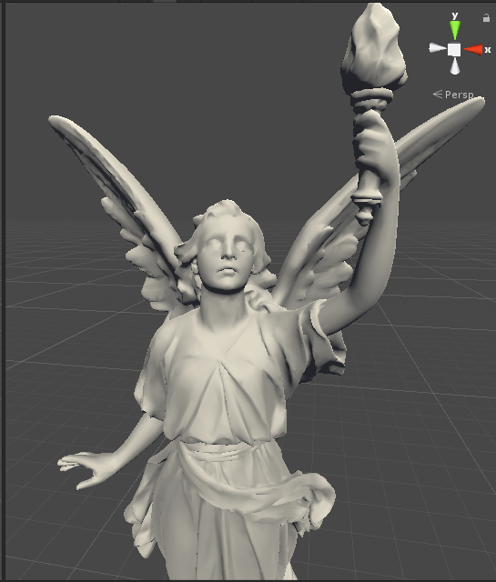</td>
        <td>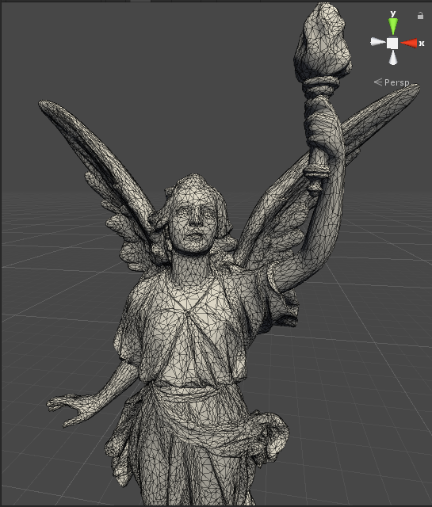</td>
    </tr>
    <tr>
        <td>10000 tris<br>(10%)</td>
        <td>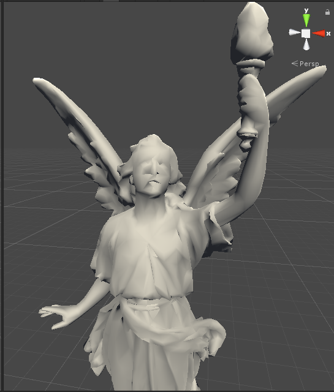</td>
        <td>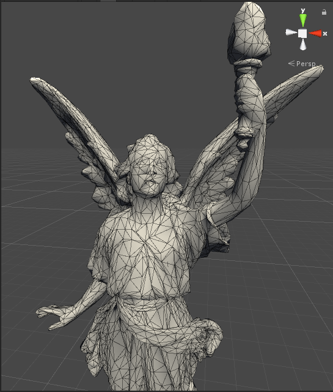</td>
    </tr>
</table>

+ Robot © Unity Technologies

<table>
    <tr>
        <td>6132 tris<br>(Source)</td>
        <td>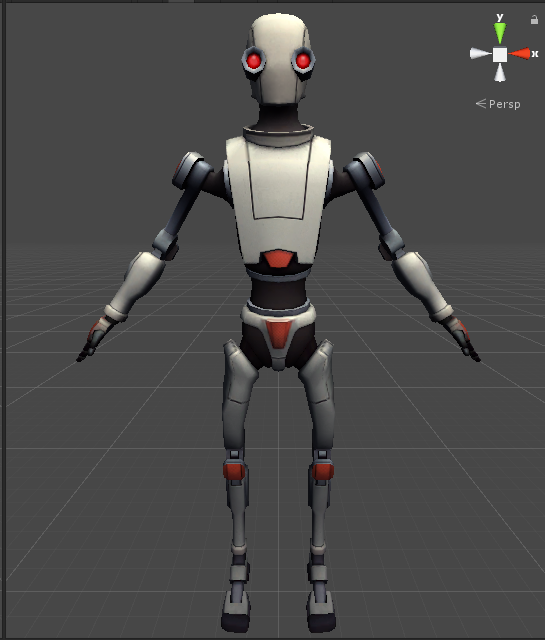</td>
        <td>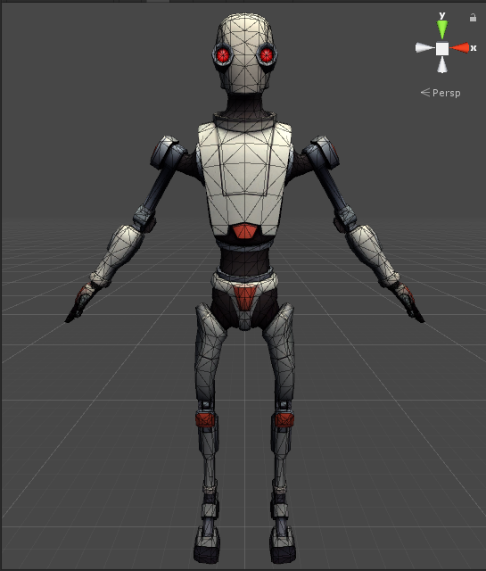</td>
    </tr>
    <tr>
        <td>3000 tris<br>(50%)</td>
        <td>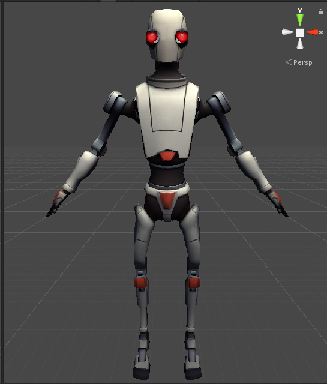</td>
        <td>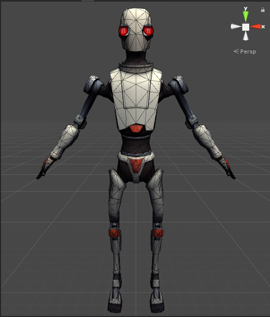</td>
    </tr>
    <tr>
        <td>600 tris<br>(10%)</td>
        <td>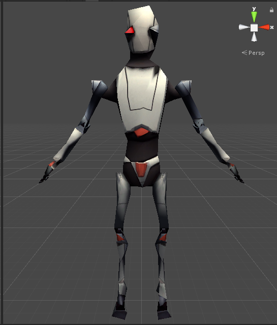</td>
        <td>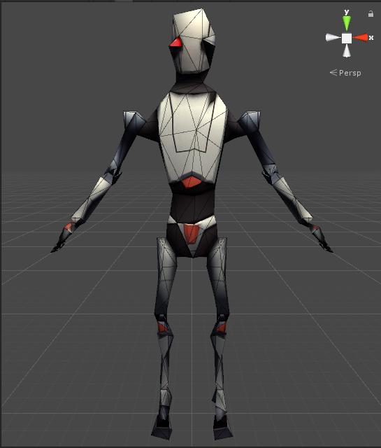</td>
    </tr>
</table>

## Quality Related

The final quality highly depends on the variants of properties. For exmaple, only position is the easiest one, just consider shape duration optimization.

But if you want to consider position, uv, normal etc. at the same time, it will lead to complicated computation, and is hard to find balance between them.

For example, the [toon shading](https://www.youtube.com/watch?v=yhGjCzxJV3E) used by Arc System Works, the color regions are highly depends on the positions of vertex.

Even if you move slightly, it may lead to severe artifacts.

+ Narmaya © Cygames, Inc

<table>
    <tr>
        <td>87753 tris<br>(Source)</td>
        <td>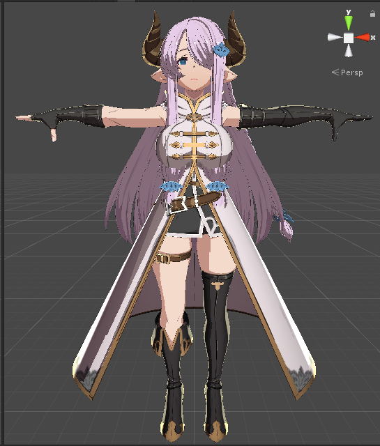</td>
        <td>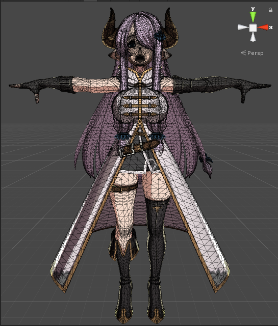</td>
    </tr>
    <tr>
        <td>48909 tris<br>(55%)</td>
        <td>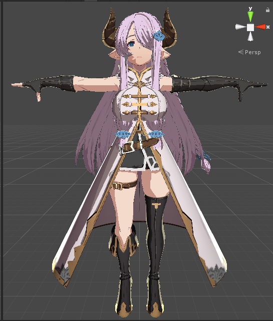</td>
        <td>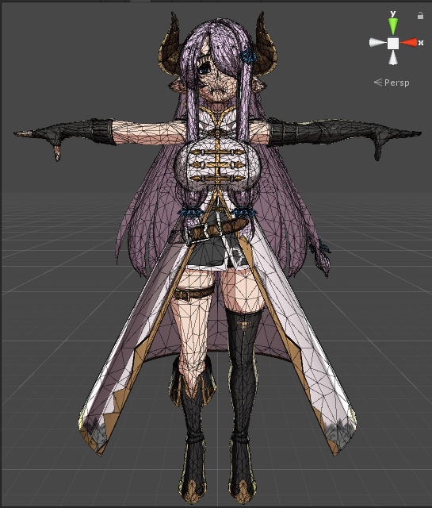</td>
    </tr>
</table>
